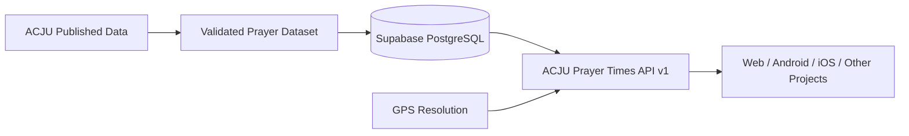

# ACJU Prayer Times API

An independent REST API for accessing prayer-time data published by the
All Ceylon Jamiyyathul Ulama (ACJU) for Sri Lanka.

Built by **KR Hasni Zihar**.

> This is an independent project and is not an official ACJU API.
> Prayer-time data is sourced from ACJU's published prayer-time documents.

## Live API

https://acju-prayer-times-api.vercel.app

## Documentation

https://github.com/hasnizihar/acju-prayer-times-api

## OpenAPI Specification

See [`openapi.yaml`](./openapi.yaml).

## Get today's prayer times using GPS

```http
GET /api/v1/prayer-times/today?lat=7.2906&lng=81.6337
```

The API resolves the coordinates through Sri Lankan administrative
boundaries and maps the resulting area to the appropriate ACJU prayer-time
region.

No user location is stored by this API.

## Quick JavaScript Example

```javascript
const response = await fetch(
  "https://acju-prayer-times-api.vercel.app/api/v1/prayer-times/today?lat=7.2906&lng=81.6337"
);

const result = await response.json();

console.log(result.data.prayer_times);
```

**Example Response:**
```json
{
  "fajr": "04:37",
  "sunrise": "05:56",
  "dhuhr": "12:07",
  "asr": "15:15",
  "maghrib": "18:16",
  "isha": "19:26"
}
```

## Available Endpoints

* **`GET /health`** - Lightweight infrastructure health check
* **`GET /api/v1/metadata`** - Dataset metadata, provider info, and versioning
* **`GET /api/v1/health`** - API status & data counts
* **`GET /api/v1/locations`** - List all 13 locations
* **`GET /api/v1/locations/resolve?lat=&lng=`** - Resolve GPS coordinates to an ACJU location
* **`GET /api/v1/locations/:slug`** - Get single location details
* **`GET /api/v1/prayer-times/today?lat=&lng=`** - Today's times (via coordinates or `?location=`)
* **`GET /api/v1/prayer-times/today/all`** - Today's times for ALL locations
* **`GET /api/v1/prayer-times/:location/:date`** - Exact date query
* **`GET /api/v1/prayer-times/:location/:year/:month`** - Whole month query
* **`GET /api/v1/prayer-times/:location?from=X&to=Y`** - Custom date range query

## Designed for Multiple Projects

This API is intended to serve as a reusable backend for applications such
as:

- Web applications
- Android applications
- iOS applications
- Desktop applications
- Prayer widgets
- University/community applications
- Islamic utility applications
- Personal projects
- Future services

Applications consume the API rather than maintaining separate copies of
the prayer-time dataset.

## Architecture



## Data & Attribution

### Prayer-time data

Prayer-time data is sourced from the published prayer-time documents of:

**All Ceylon Jamiyyathul Ulama (ACJU)**

Source:
https://www.acju.lk/prayer-times/

This project does not claim ownership of the underlying ACJU prayer-time
data.

### Software

The API software is independently developed by:

**KR Hasni Zihar**

The source code is released under the MIT License, subject to the
third-party data attribution and licensing terms described in `LICENSE`.

### Geographic data

Sri Lankan administrative geographic data is sourced from
geoBoundaries and is subject to its applicable license and attribution
requirements.

## Additional Documentation

Detailed documentation is available in the `/docs` directory:
- [API Reference](docs/API.md)
- [Data Methodology & Source](docs/DATA_SOURCE.md)
- [Data Quality & Anomalies](docs/DATA_QUALITY.md)
- [Data Model & Database](docs/DATA_MODEL.md)
- [Location Resolution Contract](docs/LOCATION_RESOLUTION.md)
- [Deployment Guide](docs/DEPLOYMENT.md)
- [Security Model](docs/SECURITY.md)
